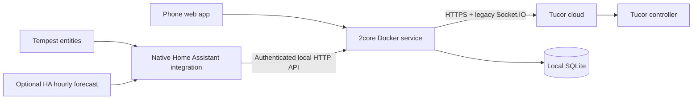

# 2core

[](https://github.com/teich/2core/actions/workflows/validate.yml)

Timed Tucor irrigation controls, a phone-friendly garden app, and a **native Home Assistant integration for 2026.09**. No MQTT.

The first implementation is runnable in simulation. Live reads were verified during protocol research. Physical start/stop and rain-delay writes are implemented from the deployed Tucor frontend, but **remain unvalidated on the hardware and disabled by default**.

Live deployment: **http://192.168.2.6:8787**. Update it with `./tools/deploy.sh`; see [deployment/update/rollback instructions](deploy/README.md) and [server details](deploy/live-server.md).

## Try it

Requires Node.js 24:

```sh
npm ci
npm run demo
```

Open **http://127.0.0.1:8787** and enter `2core-demo`. Or use Docker:

```sh
docker compose -f compose.demo.yaml up --build -d
```

The simulator never connects to Tucor. Its garden names and readings are sample data. It supports timed runs, stop, next-zone walking, favorites, notes, list order, rain delays, and weather policy. Simulator runs reset on restart; preferences and activity persist. Use a separate data directory/volume for live mode.

## Architecture



A single local service owns command serialization, credentials, run ownership, weather decisions, and durable request records. The phone and HA use the same API and see the same state. This avoids separate clients racing for Tucor's sessionful controller connection. A future iOS app can use that API too.

**This still depends on Tucor's cloud; it is not direct LAN control.** The native HA integration talks locally to 2core. Tucor schedules and the bounded watering timer remain on the controller; the app does not need to stay open.

## What works in the first version

- Zone buttons for **1, 5, 15, or 60 minutes**, countdown, explicit stop, and “Stop & run next.” Only one test run at a time. Search, favorites, walking order, local aliases, and leak notes.
- Controller voltage/current/flow, active-zone count, rain-delay status, and command activity.
- Manual rain delay and a weather policy with **off / observe / automatic** modes. Observe is the default.
- HA zone `valve` entities, status `sensor` entities, rain-delay `number`, weather-mode `select`, and timed-run actions. Unnamed station slots start disabled in HA.
- Durable duplicate-request protection, command deadlines, rejection of overlapping runs, and explicit unknown-outcome handling. No automatic write retries.

The mobile interface adapts the `claude-zones` prototype: compact zone rows open a duration/details sheet; a separate Walk view offers a zone rail, water countdown, and explicit stop-and-next control. A bottom dock keeps an owned run’s stop button accessible across all views. System dark mode, safe-area spacing, and reduced motion are supported. GPU water shaders adapted from the prototype add refraction, caustics, bubbles, spring-driven sloshing, and touch ripples. WebGPU targets current iPhones over HTTPS, with display-paced vessel animation at up to 3× pixel density and a 30 fps ambient pond. A CSS fallback survives unavailable/lost GPU contexts. Rendering pauses offscreen/when hidden; reduced motion uses static water. Controller health lives under Activity. Walking never advances automatically, and the UI never offers stop for external runs.

Historical charts and water totals are not yet part of the dashboard. Read-only history exploration remains available in the CLI.

## Install the 2core server

See **[deploy/README.md](deploy/README.md)** for Docker/LXC installation, credentials, and the supervised hardware validation sequence. No Tempest entity IDs need to be chosen when installing the server.

## Home Assistant installation with HACS

The Home Assistant integration is distributed from this repository as a HACS custom repository. It is not listed in HACS's default catalog.

1. Open HACS in Home Assistant.
2. Open the three-dot menu and select **Custom repositories**.
3. Add `https://github.com/teich/2core` with the category **Integration**.
4. Find **2core Irrigation** in HACS and select **Download**.
5. Restart Home Assistant when HACS prompts you.
6. Go to **Settings → Devices & services → Add integration**, search for **2core Irrigation**, and enter the 2core server URL and access key.

Use an address that Home Assistant itself can reach; `localhost` would refer to Home Assistant, not the 2core server. Tucor credentials remain on the Docker server. HACS only installs the files under `custom_components/tucor_2core`; it does not install or update the 2core server.

For development or recovery without HACS, copy `custom_components/tucor_2core` into HA's `/config/custom_components/`, restart HA, and add the integration under Devices & services.

After installation, open the integration's **Configure** dialog to select optional rain-intensity, recent-rainfall, and hourly-forecast entities. Start with the **Weather mode** entity set to `observe`; see [Rain intelligence](#rain-intelligence) before enabling automatic holds.

Opening a HA valve uses a bounded default duration (1 minute initially, configurable). For an explicit duration, use:

```yaml
action: tucor_2core.start_zone
data:
  config_entry_id: YOUR_2CORE_CONFIG_ENTRY_ID
  zone: 2
  minutes: 5
```

Other actions: `tucor_2core.stop_zone`, `tucor_2core.stop_my_watering`, and `tucor_2core.set_rain_delay`. The action editor supplies selectors; no YAML is required. A valve close only stops a run owned by 2core, never an unrelated scheduled run.

## Rain intelligence

When ready, select optional weather entities in the integration's **Configure** options. HA sends observations every five minutes. Supported rain units: `mm/h`, `in/h`, `mm`, and `in`. Select recent accumulation (today or rolling 24 hours), **not lifetime rainfall**. Unsupported units and observations older than 30 minutes are ignored.

Initial thresholds are 0.25 mm/h intensity, 3 mm recent accumulation, or 5 mm forecast rain with at least 70% probability. Any threshold can request a 12-hour hold. The optional forecast requires twelve complete hourly buckets and uses the lowest probability among hours predicting rain. Forecast data comes from a selected HA weather entity; a Tempest station alone need not supply it.

Automatic mode adds a hold or extends its own hold at most approximately hourly while conditions stay wet. Existing manual/external holds are preserved. Dry/missing/stale readings never cancel a hold. Turning weather mode off stops future weather decisions; it does **not** clear a hold already on the controller. Clear delay is an explicit manual operation. A daily rainfall total can keep extending a hold until that sensor resets—choose the measurement and thresholds deliberately.

Thresholds and duration can be updated through `/api/policy`; mode is also editable in HA and the web UI. See [server/API.md](server/API.md). Live control must be enabled separately on the server before Automatic can affect irrigation.

## Validation

```sh
npm test
python3.14 -m venv .venv
.venv/bin/pip install -r requirements-test.txt
.venv/bin/python -m pytest -q
```

Node tests cover protocol decoding, command duplication/expiry/restarts, run ownership, concurrency, weather decisions, and HTTP authentication. HA tests use **Home Assistant 2026.9.4** and exercise config/options flows, entity setup/actions/unload, unit normalization, and missing/stale weather. An optional end-to-end test connects actual HA code to a separate Docker simulator:

```sh
TWOCORE_TEST_URL=http://127.0.0.1:8878 .venv/bin/python -m pytest -q tests/test_docker_e2e.py
```

That test refuses a server reporting live mode and changes only simulator state. See [research/implementation-validation.md](research/implementation-validation.md) for the checks completed here and remaining hardware questions.

HACS and Home Assistant metadata are also checked by the repository's `Validate` GitHub Actions workflow.

## Home Assistant releases

HACS updates are intentionally tied to GitHub releases, not ordinary backend commits. When the Home Assistant integration changes:

1. Update `version` in `custom_components/tucor_2core/manifest.json` using semantic versioning.
2. Run the Node and Python tests above.
3. Commit and push the integration change.
4. Create and push a matching `vVERSION` tag, for example `v0.2.1`.

The release workflow verifies that the tag matches the manifest and creates the GitHub release consumed by HACS. Backend-only changes need no integration version bump or GitHub release. HACS users can then download the update and restart Home Assistant.

## Protocol research

[research/protocol.md](research/protocol.md) records recovered packets, endpoints, and evidence. Controller ID is **2479**, type LTD; the address/name is a display label. All 100 controller slots are retained; configured names determine the default displayed list.

The read-only CLI remains available:

```sh
npm run tucor -- devices
npm run tucor -- status 2479
npm run tucor -- stations 2479
npm run tucor -- history 2479 program overview
npm run tucor -- plan zone-start 2 1
npm run tucor -- plan rain-start 24
```

It prompts for credentials without echoing the password. Before controller reads, leave Tucor's website on **Device List**, because selecting a controller can make it busy for another session. No configuration synchronization is performed.

Downloaded vendor assets, account captures, local SQLite data, and secrets are Git-ignored. The old Socket.IO 2.5 client is intentional for Tucor's Engine.IO 3 protocol. Its dependency audit currently flags three moderate entries originating in `parseuri`'s ReDoS advisory. The adapter connects only to a fixed Tucor origin, never a user-supplied URL; replacing that dependency requires compatibility validation.
