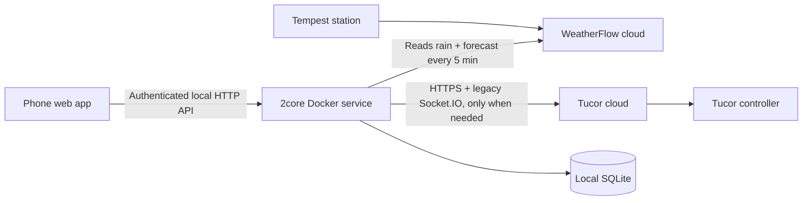

# 2core

[](https://github.com/teich/2core/actions/workflows/validate.yml)

2core is a self-hosted bridge for Tucor irrigation controllers. It provides a phone-friendly garden interface, a local HTTP API, and weather-aware rain delays driven by a Tempest weather station.

The bridge is the single client responsible for Tucor sessions, command serialization, local preferences, and weather decisions. Phones talk to the bridge over the local network; the bridge talks to Tucor's cloud service and reads weather from WeatherFlow's. Tucor account credentials stay on the bridge.

**2core is designed to be a light, polite Tucor client.** It never polls Tucor in the background. It connects only while someone is using the app, when a command is sent, or when a weather decision needs to write a rain delay. Hard limits (20 sessions per hour, 6 password logins per day) and backoff after failures hold even if a client misbehaves, and persist across restarts.

Live controller reads have been verified during protocol research. Physical start/stop and rain-delay writes are implemented from the vendor frontend's protocol, but should be validated with someone present at the irrigation system before unattended use. Live writes are disabled by default.

## Try the simulator

Requires Node.js 24:

```sh
npm ci
npm run demo
```

Open **http://127.0.0.1:8787** and enter `2core-demo`. Or use Docker:

```sh
docker compose -f compose.demo.yaml up --build -d
```

The simulator never connects to Tucor or operates irrigation hardware. Its garden names and readings are sample data. It supports timed runs, stop, next-zone walking, favorites, notes, list order, rain delays, and weather policy. Simulator runs reset on restart; preferences and activity persist. Use a separate data directory or volume for live mode. Set `DEMO_DELAY_MS=8000` to make the simulated controller take 8 seconds to answer, so the app's waiting states can be seen.

## Architecture



A single local service owns command serialization, credentials, run ownership, weather decisions, and durable request records. This avoids separate clients racing for Tucor's sessionful controller connection. Other clients can use the same authenticated API.

**This still depends on Tucor's cloud; it is not direct LAN control.** Tucor schedules and the bounded watering timer remain on the controller; the app does not need to stay open.

## Features

- Timed zone runs up to **4 hours** (a minute dial with 5-minute steps past the first hour), countdown, explicit stop, and “Stop & run next.” Only one run at a time. Search, favorites, walking order, local aliases, and leak notes.
- A **watering plan** (Plan tab, built for a phone first): a status line that says whether the plan fits overnight and names any zone that needs attention, a strip of the next fourteen nights with each night's start, finish and run order, and a zone list showing each zone's run length, frequency, next watering and a fourteen-night rhythm. One zone at a time where possible, using a second only as needed with minimum overlap to finish just before sunrise. On wider screens the nights sit beside the zones. It is a preview only; controller schedules are unchanged. See [research/scheduling-plan.md](research/scheduling-plan.md).
- **Editing in sheets:** tap a zone (in the Plan tab, or “Watering plan” in its Zones sheet) to set run length, frequency, seasonal percentage, seasonal on/off and “Water during rain delays”, then Save. Changes that fit save straight away; extra overlap, later finishes, or controller-calendar problems open a review sheet with verified fixes, “Save anyway”, or Discard. Frequencies the controller's two-week calendar can't repeat are flagged before saving. Drafts survive reload in the same browser tab.
- **Plan settings** (night window, zones at once, all-zones seasonal adjustment 50–200%, seasonal comparison zones) live in one sheet, alongside a reviewed rebalance of watering dates and a **controller-program dry run** (fixed starts, sequential steps, fourteen-day calendars, and a comparison with paused zones enabled). Program installation and sync are not implemented.
- Controller voltage/current/flow, active-zone count, rain-delay status, and command activity.
- Manual rain delay and a weather policy with **off / observe / automatic** modes. Observe is the default.
- Durable duplicate-request protection, command deadlines, rejection of overlapping runs, and explicit unknown-outcome handling. No automatic write retries.
- Immediate server acceptance: lock your phone once the request is accepted and check confirmation when you return. Stop-and-next runs entirely on the bridge.
- Opening the app connects to Tucor in the background. While you use it, one session stays open and streams controller updates; after about ten minutes without a tap, the app stops asking and the controller is released. The status pill shows whether the view is live, checked a moment ago, or paused. Activity shows Tucor sessions and logins against their limits, plus recent connection outcomes.

The mobile interface grew out of an earlier single-file prototype (removed; see git history before this commit): compact zone rows open a duration/details sheet; a separate Walk view offers a zone rail, water countdown, and explicit stop-and-next control. A bottom dock keeps an owned run’s stop button accessible across all views. System dark mode, safe-area spacing, and reduced motion are supported. GPU water shaders adapted from the prototype add refraction, caustics, bubbles, spring-driven sloshing, and touch ripples. WebGPU targets current iPhones over HTTPS, with display-paced vessel animation at up to 3× pixel density and a 30 fps ambient pond. A CSS fallback survives unavailable/lost GPU contexts. Rendering pauses offscreen/when hidden; reduced motion uses static water. Controller health lives under Activity. Walking never advances automatically, and the UI never offers stop for external runs.

Historical charts and water totals are not yet part of the dashboard. Read-only history exploration remains available in the CLI.

## Install the 2core server

The production service requires Docker, Node.js 24 in the image, an existing Tucor account, and network access to Tucor's cloud service. Start with live control disabled, verify that the controller inventory and readings are correct, and then perform the supervised hardware checks before enabling writes.

See **[deploy/README.md](deploy/README.md)** for Docker installation, secret creation, backup guidance, and the hardware-validation sequence. The checked-in `.env` example contains no account credentials. Weather is configured later and is not needed to bring up the bridge.

## Weather from your Tempest

2core reads your Tempest station directly from WeatherFlow's API every five minutes (not at all while weather mode is off): the latest observation for current rain, plus the station forecast for today's total and the next 12 hours. That is two small requests per check. On the Docker server:

1. Sign in at [tempestwx.com](https://tempestwx.com) and go to **Settings → Data Authorizations → Create Token**.
2. Run `python3 tools/configure-secrets.py --weatherflow` and paste the token. It checks the token, lists the stations on the account with their Tempest serial numbers, saves the token to `secrets/weatherflow_token`, and writes `WEATHERFLOW_STATION_ID` to `.env`.
3. Recreate the service: `docker compose -p 2core up -d --force-recreate`.

The Weather tab shows whether the station is live, the latest readings against their thresholds (in your Tempest account's units), and the latest decision with its reason. When something is wrong, it says what: not set up, rejected token, or no fresh readings. A WeatherFlow outage never adds or clears a delay; controller schedules continue as normal.

## Rain intelligence

2core uses three measurements: the current rain rate (the last minute's rain from the station's latest observation, as an hourly rate), today's total since local midnight, and the station forecast's next 12 hours. Readings older than 30 minutes are ignored.

Initial thresholds are 0.25 mm/h intensity, 3 mm today, or 5 mm forecast rain with at least 70% probability. Any threshold can request a 12-hour hold. The forecast requires twelve complete hourly buckets and uses the lowest probability among hours predicting rain.

Automatic mode adds a hold or extends its own hold at most approximately hourly while conditions stay wet. It decides from 2core's own record of the delay it set, so a rainy afternoon costs a few Tucor sessions, not one every five minutes. A delay set at the controller or in Tucor's app is discovered, and preserved, when 2core next connects to write. Existing manual/external holds are preserved. Dry/missing/stale readings never cancel a hold. Turning weather mode off stops future weather decisions; it does **not** clear a hold already on the controller. Clear delay is an explicit manual operation. Today's total keeps meeting its threshold until midnight, so a morning downpour can keep extending the hold through the day.

Thresholds and duration can be updated through `/api/policy`; mode is also editable in the web UI. See [server/API.md](server/API.md). Live control must be enabled separately on the server before Automatic can affect irrigation.

## Validation

```sh
npm run verify   # formatting, type check, and tests
```

Node tests cover protocol decoding, command duplication/expiry/restarts, run ownership, concurrency, weather decisions, WeatherFlow reads, Tucor connection limits and backoff, HTTP authentication and static serving, the web app's zone/weather/plan logic, and an end-to-end run against the demo server. Contributors and coding agents: see [AGENTS.md](AGENTS.md) for the code layout and conventions. See [research/implementation-validation.md](research/implementation-validation.md) for the checks completed here and remaining hardware questions.

## Protocol research

[research/protocol.md](research/protocol.md) records the recovered packets, endpoints, and supporting evidence for the LTD controller protocol. All 100 controller slots are retained; configured names determine the default displayed list.

The read-only CLI remains available:

```sh
npm run tucor -- devices
npm run tucor -- status CONTROLLER_ID
npm run tucor -- stations CONTROLLER_ID
npm run tucor -- history CONTROLLER_ID program overview
npm run tucor -- plan zone-start 2 1
npm run tucor -- plan rain-start 24
```

It prompts for credentials without echoing the password. Before controller reads, leave Tucor's website on **Device List**, because selecting a controller can make it busy for another session. No configuration synchronization is performed.

Downloaded vendor assets, account captures, local SQLite data, and secrets are Git-ignored. The old Socket.IO 2.5 client is intentional for Tucor's Engine.IO 3 protocol. Its dependency audit currently flags three moderate entries originating in `parseuri`'s ReDoS advisory. The adapter connects only to a fixed Tucor origin, never a user-supplied URL; replacing that dependency requires compatibility validation.
